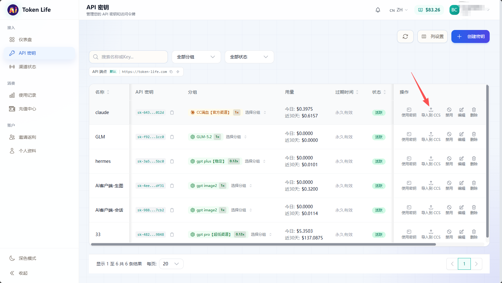
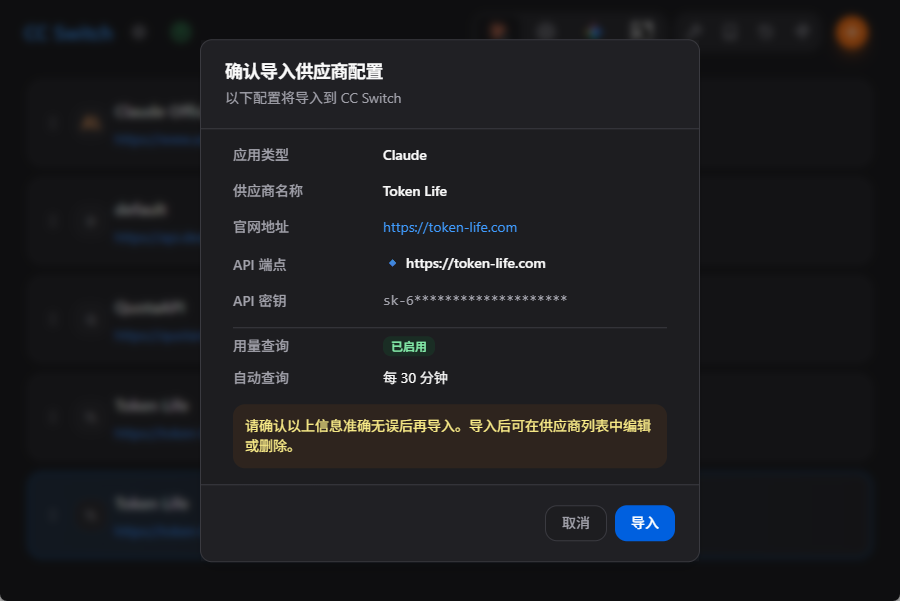

# CC Switch 导入

CC Switch 可以直接从 Token Life 控制台导入供应商配置。导入后会自动带上 Base URL、API Key 和供应商名称，不需要手动复制多项配置。

## 1. 在 API 密钥页点击导入

进入 Token Life 控制台的 API 密钥页面，找到要用于 Claude Code 或 Codex 的 API Key，在操作列点击 `导入到 CCS`。

## 2. 确认导入配置

点击后会打开 CC Switch 的确认弹窗。请检查供应商名称、官网地址、API 端点和 API 密钥是否正确。

确认无误后点击 `导入`。导入完成后，可以在 CC Switch 的供应商列表中编辑或删除该配置。

## 3. 导入参数说明

| 项目 | 推荐值 |
| --- | --- |
| 应用类型 | `Claude` |
| 供应商名称 | `Token Life` |
| 官网地址 | `https://token-life.com` |
| API 端点 | `https://token-life.com` |
| API 密钥 | Token Life 控制台创建的 API Key |

## 4. 使用建议

如果你主要使用 Claude Code，CC Switch 中的 Token Life 配置应使用 Claude 类型。Claude Code 的 Base URL 使用 `https://token-life.com`，不要额外添加 `/v1`。

如果你还需要给 OpenAI 兼容客户端使用同一个 Key，请在对应客户端中按 OpenAI 兼容方式配置 `https://token-life.com/v1`。
