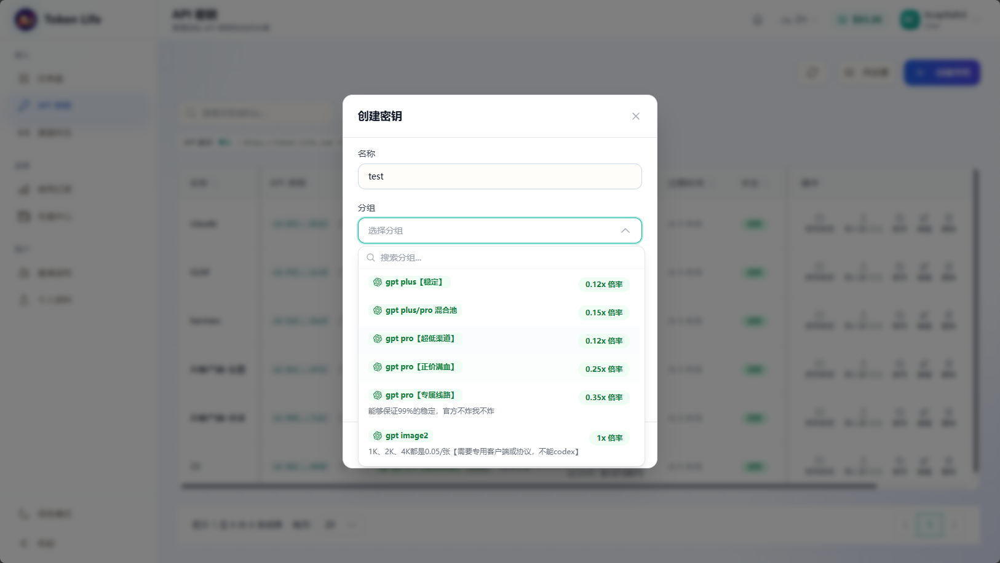

# 快速开始

## 1. 创建 API Key

登录 Token Life 控制台，进入 API 密钥页面，创建一个新的 Key。建议给 Key 设置清晰的名称，例如 `claude-code-main` 或 `codex-dev`，方便后续排查用量。



创建时需要选择一个可用分组。分组决定这个 API Key 可以访问哪些模型，以及对应倍率。

## 2. 选择客户端协议

不同客户端使用的协议不同：

| 客户端 | 协议 | Base URL |
| --- | --- | --- |
| Claude Code | Anthropic Messages | `https://token-life.com` |
| Codex CLI | OpenAI 兼容接口 | `https://token-life.com/v1` |
| CC Switch 导入 | 取决于你切换到的客户端 | 按客户端填写 |

## 3. 填写模型

模型名称需要使用控制台开放的模型名。常见写法示例：

```text
claude-sonnet-4-20250514
gpt-4.1
gpt-4.1-mini
gemini-2.5-pro
```

具体可用模型以控制台的可用渠道和渠道状态页面为准。

## 4. 验证是否成功

配置完成后，运行一次简单请求。如果客户端可以正常回复，再到控制台查看：

1. 使用记录是否出现新请求。
2. 余额是否正常扣减。
3. 渠道状态是否可用。

如果出现 401、403、404、429 等错误，先查看 [常见问题](faq.md)。
